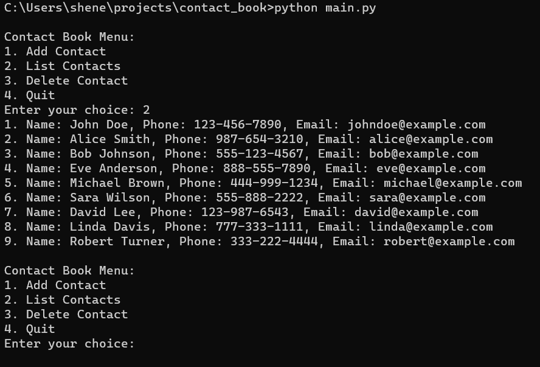

# Contact Book

Contact Book is a simple command-line application built using Python that allows users to store and manage their contacts, including names, phone numbers, and email addresses.

## Features

- Add new contacts with names, phone numbers, and email addresses.
- List all contacts in the address book.
- Delete contacts by specifying their index.

## Project Structure

- `contact_book/`: The main project directory.
    - `main.py`: The main Python script for the contact book.
    - `contact.py`: A module defining the Contact class.
    - `data/`: Directory for storing contact data.
        - `contacts.txt`: Text file to store contact information.
    - `README.md`: Documentation for the project.

## Usage

1. Run the contact book by executing `main.py`.
2. Access the contact book in your command line.
3. Choose options to add contacts, list contacts, delete contacts, or quit the program.
4. Contacts are stored in the `data/contacts.txt` file.

## Dependencies

- Python: The programming language used for the project.

## Contribution

Contributions to this project are welcome. Feel free to submit issues or pull requests.

## License

This project is open-source and available under the [MIT License](LICENSE).
